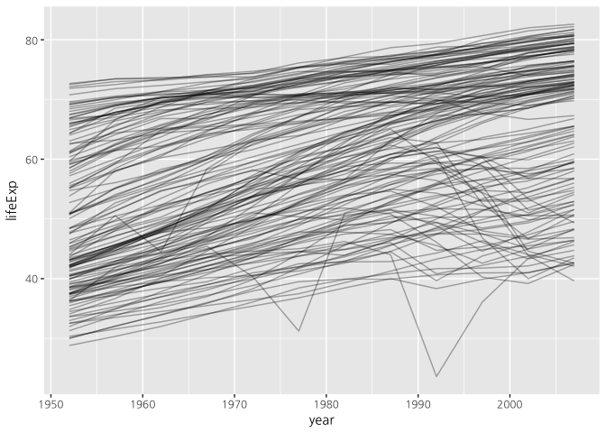
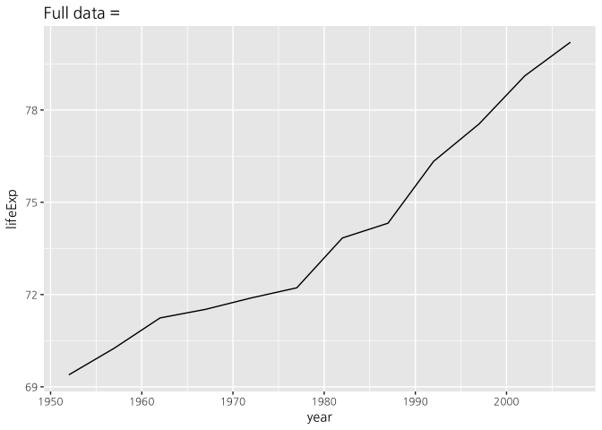
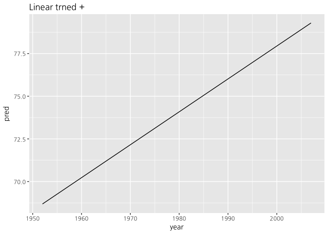
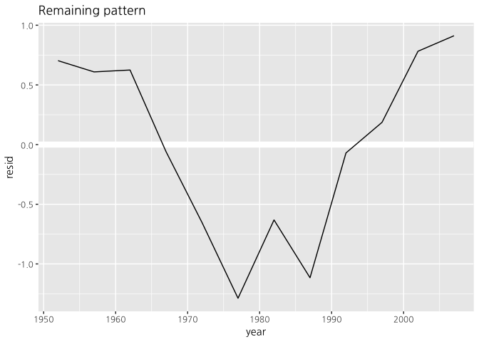
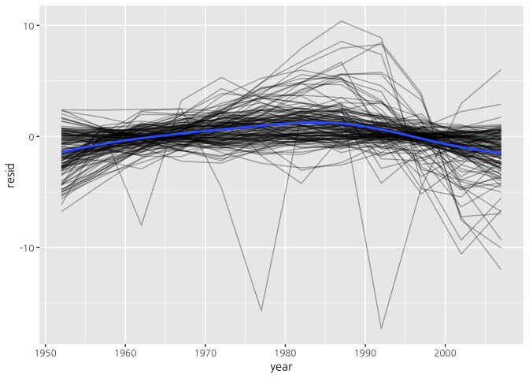
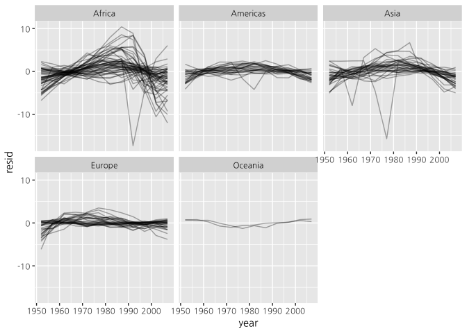
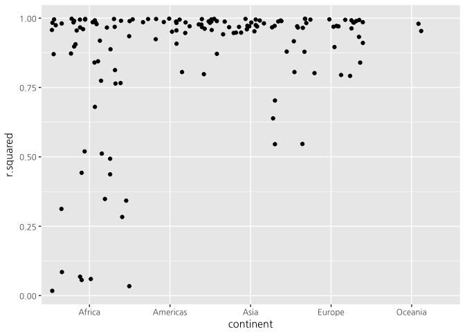
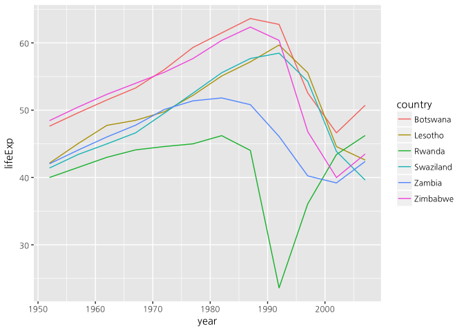

gapminder
================
Buyoun Lim
10/17/2017

``` r
library(tidyverse)
```

    ## Loading tidyverse: tibble
    ## Loading tidyverse: tidyr
    ## Loading tidyverse: readr
    ## Loading tidyverse: purrr
    ## Loading tidyverse: dplyr

    ## Warning: package 'dplyr' was built under R version 3.4.2

    ## Conflicts with tidy packages ----------------------------------------------

    ## filter(): dplyr, stats
    ## lag():    dplyr, stats

``` r
library(gapminder)
library(modelr)
library(broom)
```

    ## 
    ## Attaching package: 'broom'

    ## The following object is masked from 'package:modelr':
    ## 
    ##     bootstrap

``` r
head(gapminder)
```

    ## # A tibble: 6 x 6
    ##       country continent  year lifeExp      pop gdpPercap
    ##        <fctr>    <fctr> <int>   <dbl>    <int>     <dbl>
    ## 1 Afghanistan      Asia  1952  28.801  8425333  779.4453
    ## 2 Afghanistan      Asia  1957  30.332  9240934  820.8530
    ## 3 Afghanistan      Asia  1962  31.997 10267083  853.1007
    ## 4 Afghanistan      Asia  1967  34.020 11537966  836.1971
    ## 5 Afghanistan      Asia  1972  36.088 13079460  739.9811
    ## 6 Afghanistan      Asia  1977  38.438 14880372  786.1134

Reference : R for Data Science - Hadley Wickham
-----------------------------------------------

각 나라마다(country) 시간이 지날수록(year) 평균수명(lifeExp)이 어떻게 변하는가?
-------------------------------------------------------------------------------

``` r
gapminder %>%
  ggplot(aes(year, lifeExp, group=country)) +
  geom_line(alpha = 1/3)
```



시간이 흐를수록 평균수명이 증가하는 추세를 보이지만, 몇몇 나라는 그렇지 않다. 이 나라들을 어떻게 하면 더 쉽게 시각화 하여 볼수 있을까?

linear한 트렌드가 있기 때문에, 이 트렌드가 설명하는 부분을 제거하고 남은부분(residual)을 살펴보자.

먼저 뉴질랜드에 대해서만 살펴보자.

``` r
nz <- filter(gapminder, country == "New Zealand")
nz %>% 
  ggplot(aes(year, lifeExp)) +
  geom_line() +
  ggtitle("Full data = ")
```



``` r
nz_mod <- lm(lifeExp ~ year, data = nz)
nz %>%
  add_predictions(nz_mod) %>% #add_predictions 함수는 nz dataframe에서 nz_mod 모델의 fitted value를 pred column에 추가한 dataframe을 return 한다
  ggplot(aes(year, pred)) +
  geom_line() +
  ggtitle("Linear trned + ")
```



``` r
nz %>% 
  add_residuals(nz_mod) %>% #add_residuals는 add_predictions와 비슷하게, residual을 resid column에 추가한 dataframe을 return 한다 
  ggplot(aes(year, resid)) +
  geom_hline(yintercept = 0, color = "white", size = 3) +
  geom_line() +
  ggtitle("Remaining pattern")
```



어떻게 하면 모든 나라에 대해서 위 작업을 쉽게 할수 있을까?

Nested Data
-----------

위의 작업을 gapminder dataframe의 각각의 나라, 즉 행(row)들의 subset들에 대해 해야한다. 이것을 위해, nested data frame이라는 새로운 data structure가 필요하다. 이 data structure를 만드려면 nest() 함수를 쓰면 된다.

``` r
by_country <- gapminder %>%
  group_by(country, continent) %>%
  nest()
by_country
```

    ## # A tibble: 142 x 3
    ##        country continent              data
    ##         <fctr>    <fctr>            <list>
    ##  1 Afghanistan      Asia <tibble [12 x 4]>
    ##  2     Albania    Europe <tibble [12 x 4]>
    ##  3     Algeria    Africa <tibble [12 x 4]>
    ##  4      Angola    Africa <tibble [12 x 4]>
    ##  5   Argentina  Americas <tibble [12 x 4]>
    ##  6   Australia   Oceania <tibble [12 x 4]>
    ##  7     Austria    Europe <tibble [12 x 4]>
    ##  8     Bahrain      Asia <tibble [12 x 4]>
    ##  9  Bangladesh      Asia <tibble [12 x 4]>
    ## 10     Belgium    Europe <tibble [12 x 4]>
    ## # ... with 132 more rows

``` r
by_country$data[[1]]
```

    ## # A tibble: 12 x 4
    ##     year lifeExp      pop gdpPercap
    ##    <int>   <dbl>    <int>     <dbl>
    ##  1  1952  28.801  8425333  779.4453
    ##  2  1957  30.332  9240934  820.8530
    ##  3  1962  31.997 10267083  853.1007
    ##  4  1967  34.020 11537966  836.1971
    ##  5  1972  36.088 13079460  739.9811
    ##  6  1977  38.438 14880372  786.1134
    ##  7  1982  39.854 12881816  978.0114
    ##  8  1987  40.822 13867957  852.3959
    ##  9  1992  41.674 16317921  649.3414
    ## 10  1997  41.763 22227415  635.3414
    ## 11  2002  42.129 25268405  726.7341
    ## 12  2007  43.828 31889923  974.5803

``` r
class(by_country$data)
```

    ## [1] "list"

by\_country를 살펴보면, country, continent로 group을 지었고, data라는 column이 생겼는데, 이 column은 dataframe을 원소로 하는 list 이다. 일반적인 dataframe은 각각의 행이 관측치 이지만, nested datframe은 각각의 행이 그룹이다.

data column은 list이므로, purrr::map() 함수를 이용해서 list의 원소인 각 dataframe에 회귀분석 모델을 적용해보자.

``` r
country_model <- function(df) {
  lm(lifeExp ~ year, data = df)
}
models <- map(by_country$data, country_model)
models[[1]]
```

    ## 
    ## Call:
    ## lm(formula = lifeExp ~ year, data = df)
    ## 
    ## Coefficients:
    ## (Intercept)         year  
    ##   -507.5343       0.2753

회귀분석 결과를 dataframe과 따로 저장하는것 보다, dataframe의 하나의 column에 저장하는 것이 낫다.

``` r
by_country <- by_country %>%
  mutate(model = map(data, country_model)) 
by_country
```

    ## # A tibble: 142 x 4
    ##        country continent              data    model
    ##         <fctr>    <fctr>            <list>   <list>
    ##  1 Afghanistan      Asia <tibble [12 x 4]> <S3: lm>
    ##  2     Albania    Europe <tibble [12 x 4]> <S3: lm>
    ##  3     Algeria    Africa <tibble [12 x 4]> <S3: lm>
    ##  4      Angola    Africa <tibble [12 x 4]> <S3: lm>
    ##  5   Argentina  Americas <tibble [12 x 4]> <S3: lm>
    ##  6   Australia   Oceania <tibble [12 x 4]> <S3: lm>
    ##  7     Austria    Europe <tibble [12 x 4]> <S3: lm>
    ##  8     Bahrain      Asia <tibble [12 x 4]> <S3: lm>
    ##  9  Bangladesh      Asia <tibble [12 x 4]> <S3: lm>
    ## 10     Belgium    Europe <tibble [12 x 4]> <S3: lm>
    ## # ... with 132 more rows

``` r
by_country$model[[1]]
```

    ## 
    ## Call:
    ## lm(formula = lifeExp ~ year, data = df)
    ## 
    ## Coefficients:
    ## (Intercept)         year  
    ##   -507.5343       0.2753

이렇게 하면 모든 관련된 objects들이 같이 저장되기 떄문에, filter나 arrange를 할 때, 따로따로 하여 sync할 필요 없이 한번에 할 수 있다.

``` r
by_country %>%
  filter(continent == "Europe")
```

    ## # A tibble: 30 x 4
    ##                   country continent              data    model
    ##                    <fctr>    <fctr>            <list>   <list>
    ##  1                Albania    Europe <tibble [12 x 4]> <S3: lm>
    ##  2                Austria    Europe <tibble [12 x 4]> <S3: lm>
    ##  3                Belgium    Europe <tibble [12 x 4]> <S3: lm>
    ##  4 Bosnia and Herzegovina    Europe <tibble [12 x 4]> <S3: lm>
    ##  5               Bulgaria    Europe <tibble [12 x 4]> <S3: lm>
    ##  6                Croatia    Europe <tibble [12 x 4]> <S3: lm>
    ##  7         Czech Republic    Europe <tibble [12 x 4]> <S3: lm>
    ##  8                Denmark    Europe <tibble [12 x 4]> <S3: lm>
    ##  9                Finland    Europe <tibble [12 x 4]> <S3: lm>
    ## 10                 France    Europe <tibble [12 x 4]> <S3: lm>
    ## # ... with 20 more rows

``` r
by_country %>%
  arrange(continent, country)
```

    ## # A tibble: 142 x 4
    ##                     country continent              data    model
    ##                      <fctr>    <fctr>            <list>   <list>
    ##  1                  Algeria    Africa <tibble [12 x 4]> <S3: lm>
    ##  2                   Angola    Africa <tibble [12 x 4]> <S3: lm>
    ##  3                    Benin    Africa <tibble [12 x 4]> <S3: lm>
    ##  4                 Botswana    Africa <tibble [12 x 4]> <S3: lm>
    ##  5             Burkina Faso    Africa <tibble [12 x 4]> <S3: lm>
    ##  6                  Burundi    Africa <tibble [12 x 4]> <S3: lm>
    ##  7                 Cameroon    Africa <tibble [12 x 4]> <S3: lm>
    ##  8 Central African Republic    Africa <tibble [12 x 4]> <S3: lm>
    ##  9                     Chad    Africa <tibble [12 x 4]> <S3: lm>
    ## 10                  Comoros    Africa <tibble [12 x 4]> <S3: lm>
    ## # ... with 132 more rows

Unnesting
---------

각 행의 data 열에는 그 나라의 관측치 dataframe, model 열에는 관측치 dataframe을 input으로 한 linear model이 있으므로, 이 두개를 input으로 하여 나오는 residual이 포함된 dataframe을 resids column에 추가해보자.

``` r
by_country <- by_country %>%
  mutate(resids = map2(data, model, add_residuals))
by_country$resids[[1]]
```

    ## # A tibble: 12 x 5
    ##     year lifeExp      pop gdpPercap       resid
    ##    <int>   <dbl>    <int>     <dbl>       <dbl>
    ##  1  1952  28.801  8425333  779.4453 -1.10629487
    ##  2  1957  30.332  9240934  820.8530 -0.95193823
    ##  3  1962  31.997 10267083  853.1007 -0.66358159
    ##  4  1967  34.020 11537966  836.1971 -0.01722494
    ##  5  1972  36.088 13079460  739.9811  0.67413170
    ##  6  1977  38.438 14880372  786.1134  1.64748834
    ##  7  1982  39.854 12881816  978.0114  1.68684499
    ##  8  1987  40.822 13867957  852.3959  1.27820163
    ##  9  1992  41.674 16317921  649.3414  0.75355828
    ## 10  1997  41.763 22227415  635.3414 -0.53408508
    ## 11  2002  42.129 25268405  726.7341 -1.54472844
    ## 12  2007  43.828 31889923  974.5803 -1.22237179

이제 어떻게 하면 datframe list를 plotting 할수 있을까? 일단 unnest() 함수로 nested dataframe을 일반적인 dataframe으로 다시 바꿔보자.

``` r
resids <- unnest(by_country, resids)
resids
```

    ## # A tibble: 1,704 x 7
    ##        country continent  year lifeExp      pop gdpPercap       resid
    ##         <fctr>    <fctr> <int>   <dbl>    <int>     <dbl>       <dbl>
    ##  1 Afghanistan      Asia  1952  28.801  8425333  779.4453 -1.10629487
    ##  2 Afghanistan      Asia  1957  30.332  9240934  820.8530 -0.95193823
    ##  3 Afghanistan      Asia  1962  31.997 10267083  853.1007 -0.66358159
    ##  4 Afghanistan      Asia  1967  34.020 11537966  836.1971 -0.01722494
    ##  5 Afghanistan      Asia  1972  36.088 13079460  739.9811  0.67413170
    ##  6 Afghanistan      Asia  1977  38.438 14880372  786.1134  1.64748834
    ##  7 Afghanistan      Asia  1982  39.854 12881816  978.0114  1.68684499
    ##  8 Afghanistan      Asia  1987  40.822 13867957  852.3959  1.27820163
    ##  9 Afghanistan      Asia  1992  41.674 16317921  649.3414  0.75355828
    ## 10 Afghanistan      Asia  1997  41.763 22227415  635.3414 -0.53408508
    ## # ... with 1,694 more rows

``` r
glimpse(resids)
```

    ## Observations: 1,704
    ## Variables: 7
    ## $ country   <fctr> Afghanistan, Afghanistan, Afghanistan, Afghanistan,...
    ## $ continent <fctr> Asia, Asia, Asia, Asia, Asia, Asia, Asia, Asia, Asi...
    ## $ year      <int> 1952, 1957, 1962, 1967, 1972, 1977, 1982, 1987, 1992...
    ## $ lifeExp   <dbl> 28.801, 30.332, 31.997, 34.020, 36.088, 38.438, 39.8...
    ## $ pop       <int> 8425333, 9240934, 10267083, 11537966, 13079460, 1488...
    ## $ gdpPercap <dbl> 779.4453, 820.8530, 853.1007, 836.1971, 739.9811, 78...
    ## $ resid     <dbl> -1.10629487, -0.95193823, -0.66358159, -0.01722494, ...

원래의 dataframe에 nested된 resids column이 같이 unnested되어 return 된다. unnest() 함수의 두번째 argument에는 vector들의 list나 dataframe들의 list가 와야 한다. (그래야 list의 각 원소인 vector나 dataframe이 row-bind가 되면서 unnested의 형태가 된다.)

이제 각 나라마다 residual을 plot 해보자.

``` r
resids %>%
  ggplot(aes(year, resid)) +
  geom_line(aes(group = country), alpha = 1/3) +
  geom_smooth(se = FALSE)
```

    ## `geom_smooth()` using method = 'gam'



``` r
resids %>%
  ggplot(aes(year, resid, group = country)) +
  geom_line(alpha = 1/3) +
  facet_wrap(~continent)
```



Africa를 살펴보면, residual이 굉장히 크다. 즉 시간(year)이 평균수명(lifeExp)을 linear model로 잘 설명을 하지 못한다는 것이다.

Model Quality
-------------

linear model의 결과를 평가하기 위해, 평가지표를 살펴보자. broom::glance()는 model의 결과를 tidy data형태로 바꿔준다.

``` r
glance(nz_mod)
```

    ##   r.squared adj.r.squared     sigma statistic      p.value df    logLik
    ## 1 0.9535846     0.9489431 0.8043472  205.4459 5.407324e-08  2 -13.32064
    ##        AIC    BIC deviance df.residual
    ## 1 32.64128 34.096 6.469743          10

``` r
class(glance(nz_mod))
```

    ## [1] "data.frame"

nested dataframe에 있는 model에 glance() 함수를 적용해보자.

``` r
by_country %>%
  mutate(glance = map(model, glance)) %>%
  unnest(glance)
```

    ## # A tibble: 142 x 16
    ##        country continent              data    model            resids
    ##         <fctr>    <fctr>            <list>   <list>            <list>
    ##  1 Afghanistan      Asia <tibble [12 x 4]> <S3: lm> <tibble [12 x 5]>
    ##  2     Albania    Europe <tibble [12 x 4]> <S3: lm> <tibble [12 x 5]>
    ##  3     Algeria    Africa <tibble [12 x 4]> <S3: lm> <tibble [12 x 5]>
    ##  4      Angola    Africa <tibble [12 x 4]> <S3: lm> <tibble [12 x 5]>
    ##  5   Argentina  Americas <tibble [12 x 4]> <S3: lm> <tibble [12 x 5]>
    ##  6   Australia   Oceania <tibble [12 x 4]> <S3: lm> <tibble [12 x 5]>
    ##  7     Austria    Europe <tibble [12 x 4]> <S3: lm> <tibble [12 x 5]>
    ##  8     Bahrain      Asia <tibble [12 x 4]> <S3: lm> <tibble [12 x 5]>
    ##  9  Bangladesh      Asia <tibble [12 x 4]> <S3: lm> <tibble [12 x 5]>
    ## 10     Belgium    Europe <tibble [12 x 4]> <S3: lm> <tibble [12 x 5]>
    ## # ... with 132 more rows, and 11 more variables: r.squared <dbl>,
    ## #   adj.r.squared <dbl>, sigma <dbl>, statistic <dbl>, p.value <dbl>,
    ## #   df <int>, logLik <dbl>, AIC <dbl>, BIC <dbl>, deviance <dbl>,
    ## #   df.residual <int>

unnest를 했지만, 여전히 list column이 남아았다. glance() 함수가 return하는 dataframe은 한개의 행으로 되어있다. 이러한 경우 unnest() 함수는 위와 같이 default로 실행된다. 왜냐하면 unnest를 할때, 처음에 nest를 할때 묶인 dataframe을 다시 풀어줘야 하는데, 이 dataframe의 row의 갯수와 unnest() 함수의 두번째 argument로 들어가는 list column의 원소인 dataframe의 row의 갯수가 같으면 list column이 없는 채로 unnest가 잘 되지만, 전자의 갯수가 후자의 갯수보다 적으면 unnest를 제대로 할수 없기 떄문이다. .drop = TRUE 옵션을 주면 문제가 해결된다.

``` r
glance <- by_country %>%
  mutate(glance = map(model, glance)) %>%
  unnest(glance, .drop = TRUE)
glance
```

    ## # A tibble: 142 x 13
    ##        country continent r.squared adj.r.squared     sigma  statistic
    ##         <fctr>    <fctr>     <dbl>         <dbl>     <dbl>      <dbl>
    ##  1 Afghanistan      Asia 0.9477123     0.9424835 1.2227880  181.24941
    ##  2     Albania    Europe 0.9105778     0.9016355 1.9830615  101.82901
    ##  3     Algeria    Africa 0.9851172     0.9836289 1.3230064  661.91709
    ##  4      Angola    Africa 0.8878146     0.8765961 1.4070091   79.13818
    ##  5   Argentina  Americas 0.9955681     0.9951249 0.2923072 2246.36635
    ##  6   Australia   Oceania 0.9796477     0.9776125 0.6206086  481.34586
    ##  7     Austria    Europe 0.9921340     0.9913474 0.4074094 1261.29629
    ##  8     Bahrain      Asia 0.9667398     0.9634138 1.6395865  290.65974
    ##  9  Bangladesh      Asia 0.9893609     0.9882970 0.9766908  929.92637
    ## 10     Belgium    Europe 0.9945406     0.9939946 0.2929025 1821.68840
    ## # ... with 132 more rows, and 7 more variables: p.value <dbl>, df <int>,
    ## #   logLik <dbl>, AIC <dbl>, BIC <dbl>, deviance <dbl>, df.residual <int>

이제 R^2를 기준으로 arragne를 하여 model을 평가해보자.

``` r
glance %>%
  arrange(r.squared)
```

    ## # A tibble: 142 x 13
    ##             country continent  r.squared adj.r.squared    sigma statistic
    ##              <fctr>    <fctr>      <dbl>         <dbl>    <dbl>     <dbl>
    ##  1           Rwanda    Africa 0.01715964  -0.081124401 6.558269 0.1745923
    ##  2         Botswana    Africa 0.03402340  -0.062574259 6.112177 0.3522177
    ##  3         Zimbabwe    Africa 0.05623196  -0.038144842 7.205431 0.5958240
    ##  4           Zambia    Africa 0.05983644  -0.034179918 4.528713 0.6364471
    ##  5        Swaziland    Africa 0.06821087  -0.024968046 6.644091 0.7320419
    ##  6          Lesotho    Africa 0.08485635  -0.006658011 5.933934 0.9272463
    ##  7    Cote d'Ivoire    Africa 0.28337240   0.211709644 3.925590 3.9542491
    ##  8     South Africa    Africa 0.31246865   0.243715518 4.744356 4.5447914
    ##  9           Uganda    Africa 0.34215382   0.276369202 3.187668 5.2011219
    ## 10 Congo, Dem. Rep.    Africa 0.34820278   0.283023054 2.429489 5.3421948
    ## # ... with 132 more rows, and 7 more variables: p.value <dbl>, df <int>,
    ## #   logLik <dbl>, AIC <dbl>, BIC <dbl>, deviance <dbl>, df.residual <int>

Africa가 linear model로 잘 설명이 되지 않음을 확인할수 있다.

``` r
glance %>%
  ggplot(aes(continent, r.squared)) +
  geom_jitter(width = 0.5)
```



위 그래프에서 보이듯이, africa의 많은 나라들의 R^2가 좋지 않음을 볼수 있다.

R^2가 0.25인 나라들만 뽑아서 year과 lifeExp의 관계를 plotting 해보자.

``` r
bad_fit <- filter(glance, r.squared < 0.25)
gapminder %>%
  semi_join(bad_fit, by = "country") %>%
  ggplot(aes(year, lifeExp, color = country)) +
  geom_line()
```



위 나라들의 1990년 이후 비슷하게 평균수명이 감소함을 알 수 있다. 이때 HIV/AIDS 전염병과 르완다의 대량학살이 있었다.
